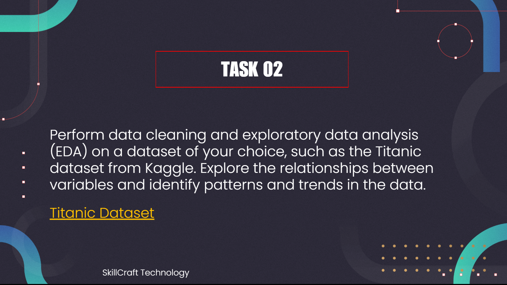

---

#

# SKILLCRAFT_DS_02

# SkillCraft Technology – Data Science Internship (Task 2)

Hi there!  
I'm **RITHIK**, and this repository showcases my submission for **Task 2** of the **SkillCraft Technology Data Science Internship**. In this task, I worked on the **Titanic Dataset** to perform **Data Cleaning**, **Exploratory Data Analysis (EDA)**, and **Machine Learning Modeling** to uncover insights and build predictive models.

---

## 🌍 About the Dataset

The dataset used in this project is the famous [**Titanic Dataset**](https://www.kaggle.com/c/titanic/data), which contains details about passengers aboard the RMS Titanic. Key features include:

- PassengerId
  
- Survived (Target variable)
  
- Pclass (Ticket class)
  
- Name
  
- Sex
  
- Age
  
- SibSp (Siblings/Spouses aboard)
  
- Parch (Parents/Children aboard)
  
- Fare
  
- Embarked (Port of embarkation)  
  ... and more.
  

---

## 🛠 Tech Stack

  
  
  
  
  
  

---

## 🔍 Project Workflow

### **1. Data Exploration**

- Loaded the dataset using `pandas`
  
- Checked data structure, column types, and missing values
  

### **2. Data Cleaning**

- Dropped irrelevant columns (`Ticket`, `Cabin`)
  
- Filled missing values in `Age` and `Embarked`
  
- Converted categorical features for model compatibility
  

### **3. Exploratory Data Analysis (EDA)**

Created meaningful visualizations:

- **Survival Distribution** – Bar charts, pie charts
  
- **Feature Comparison** – Count plots for `Sex`, `Pclass`, and `Embarked` vs `Survived`
  
- **Numerical Distributions** – Histograms and boxplots for `Age`, `Fare`, `Parch`
  
- **Correlation Analysis** – Heatmap of numerical features
  

### **4. Machine Learning Modeling**

Built and evaluated multiple models:

- **Logistic Regression**
  
- **Naive Bayes**
  
- **Decision Tree**
  
- **Support Vector Machine (SVM)**
  
- **K-Nearest Neighbors (KNN)**
  

Evaluation was done using **accuracy score** and **confusion matrix**.

---

## 💡 Key Insights

✔ **Gender Influence**: Females had a higher survival rate than males  
✔ **Class Impact**: 1st class passengers had better survival chances  
✔ **Embarkation Factor**: Passengers from Cherbourg (C) had higher survival rates  
✔ **Best Model**: Naive Bayes achieved the highest accuracy among the models tested

---

## 📊 Model Performance Summary

| Model | Accuracy Score |
| --- | --- |
| **Naive Bayes** | 0.76 |
| Logistic Regression | 0.75 |
| Decision Tree | 0.74 |
| Support Vector Machine | 0.66 |
| K-Nearest Neighbors | 0.66 |

---

## 🎯 Conclusion

This task was an excellent opportunity to work on a real-world dataset, perform **data preprocessing**, visualize insights through **EDA**, and build **predictive models**. It highlighted the importance of **feature engineering** and **model selection** in machine learning workflows.

---

✅ **Suggestion for header image:** Use an image like this at the top for a professional look:  

---

🔗 Connect with Me LinkedIn: Rithik CA

Portfolio: (Coming Soon)

⭐ If you found this project helpful, consider giving it a star on GitHub! 🔗 Author: Rithik CA 💻 Tech Stack: Python • Pandas • Seaborn • Matplotlib • Jupyter Notebook 📬 Let's Connect: [Connect with me on LinkedIn](https://github.com/28Rithik/SKILLCRAFT_DS_TASK_01/blob/main/www.linkedin.com/in/rithik-ca-a39b02292) | Portfolio
